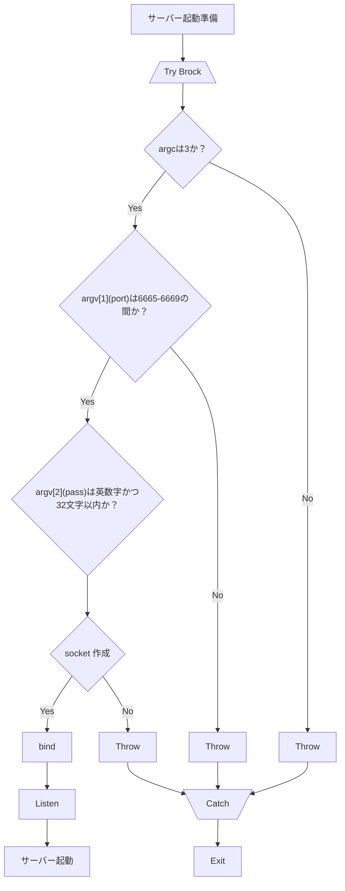

## サーバー起動準備



```cpp
class Server {
public:
    Server(int argc, const char *argv[]);
    ~Server();
private:
    int sfd;
    struct sockaddr_in addr;
}
```

```cpp
#include <sys/socket.h>
#include <netinet/in.h>
#include <cstring> // stderro
#include <cstdlib>
#include <iostream>
#include <unistd.h>

#define PORT_NUM 6667


int main() {
    struct sockaddr_in addr;

    int sfd = socket(AF_INET, SOCK_STREAM, 0);
    if (sfd == -1) {
//        throw std::strerror(errno);
        std::exit(1);
    }

    memset(&addr, 0, sizeof(struct sockaddr_in));
    addr.sin_family = AF_INET;
//    addr.sin_addr.s_addr = inet_addr("127.0.0.1")
    addr.sin_addr.s_addr=htonl(INADDR_LOOPBACK);
    addr.sin_port = htons(PORT_NUM);


    if (bind(sfd, (struct sockaddr *) &addr, sizeof(struct sockaddr_in)) == -1) {
//        throw std::strerror(errno);
        std::exit(1);
    }

    if (listen(sfd, SOMAXCONN) == -1) {
//        throw std::strerror(errno);
        std::exit(1);
    }

//    while (1) {
        struct sockaddr_in claddr;
        socklen_t addrlen(sizeof(struct sockaddr_in));
        int cfd;

        memset(&claddr, 0, sizeof(struct sockaddr_in));
        if ((cfd = accept(sfd, NULL, NULL)) == -1) {
//            std::cout << "test" << std::endl;
            std::exit(1);
        }

        char buf[512];
        if (recv(cfd, buf, 512, 0) == -1) {
            std::exit(1);
        }
        std::cout << buf << std::endl;
//    }
    close(cfd);
}
```