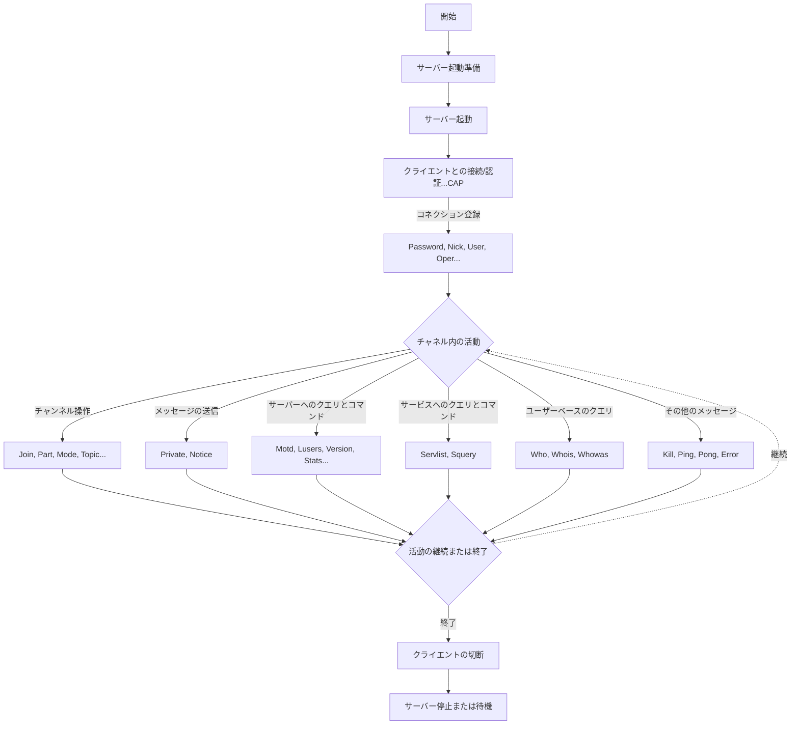
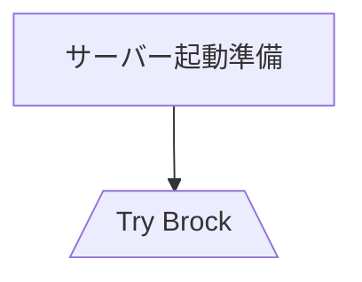
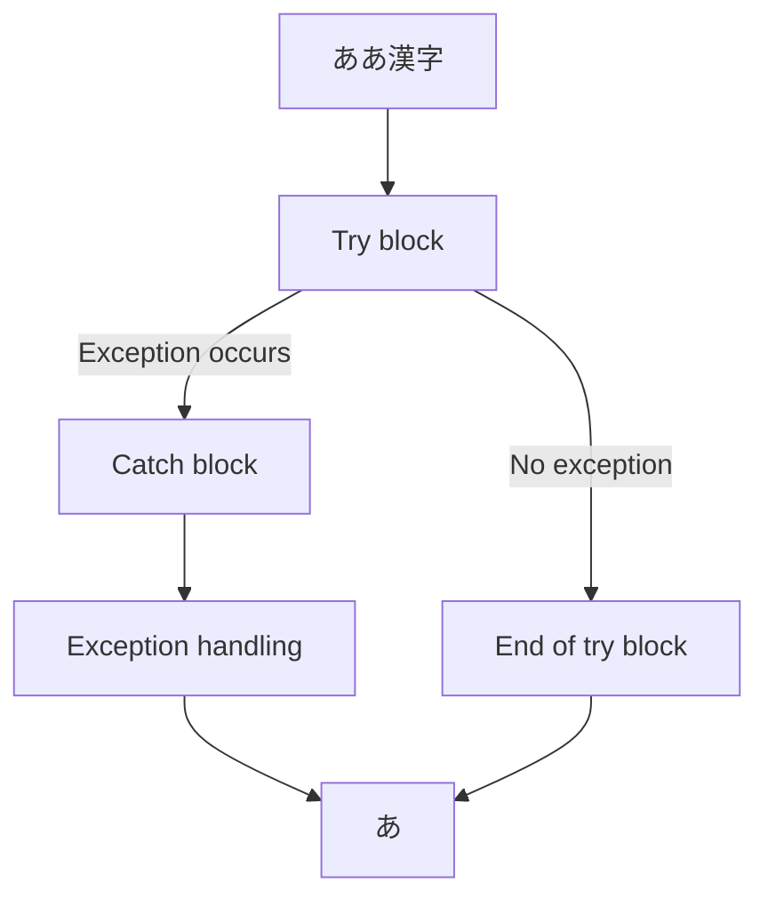

## IRC Server Architecture Overview

```mermaid
flowchart TD
    A[開始] --> B[サーバー起動準備]
    B --> C[サーバー起動]
    C --> D[クライエントとの接続/認証...CAP]
    D -- コネクション登録 --> E[Password, Nick, User, Oper...]
    E --> F{チャネル内の活動}
    F -- チャンネル操作 --> G[Join, Part, Mode, Topic...]
    F -- メッセージの送信 --> H[Private, Notice]
    F -- サーバーへのクエリとコマンド --> I[Motd, Lusers, Version, Stats...]
    F -- サービスへのクエリとコマンド --> J[Servlist, Squery]
    F -- ユーザーベースのクエリ --> K[Who, Whois, Whowas]
    F -- その他のメッセージ --> L[Kill, Ping, Pong, Error]
    G --> M{活動の継続または終了}
    H --> M{活動の継続または終了}
    I --> M{活動の継続または終了}
    J --> M{活動の継続または終了}
    K --> M{活動の継続または終了}
    L --> M{活動の継続または終了}
    M -. 継続 .-> F
    M -- 終了 --> N[クライエントの切断]
    N --> O[サーバー停止または待機]

    click B href "Makefile"
    click C href "google.com"
```

## サーバー起動準備

```mermaid
graph TD
    A[サーバー起動準備] --> B[/Try Brock\]

```

```mermaid
graph TD
    A[ああ漢字] --> B[Try block]
    B -- Exception occurs --> C[Catch block]
    B -- No exception --> D[End of try block]
    C --> E[Exception handling]
    E --> F[Continue after catch]
    D --> F[あ]

```

server::server(int argc, const char *argv[])