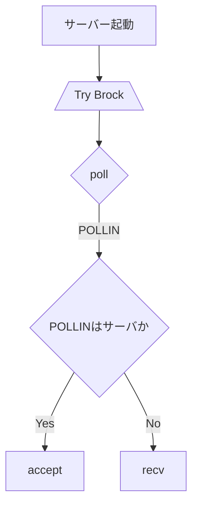

## サーバー起動準備




### Serverクラス
```cpp
class Server {
public:
    Server(int argc, const char *argv[]);
    ~Server();
    void run();
    void changeNickname(const std::stirng &before, const std::string &after);
    const std::string &getServerName() const;
    const std::string &getNickHistory() const;
    void setNickHistory(const string &nick);

private:

    std::string serverName; //    > 1.1 サーバー  サーバーは名前で一意に識別されます。この名前は、最大63文字（63）の文字です。サーバー名で使用される可能性のあるもの、および使用されないものについては、プロトコル文法ルール（セクション2.3.1）を参照してください。
    void checkServerName(const std::string &serverName) const;

    std::string password; // 32 自分で決めた
    void checkPassword(const std::string &password) const;

    short port; //
    void checkPortNum(const std::string &port) const;

    int sfd;
    struct sockaddr_in _addr;
    std::vector <struct pollfd> _pollFd;

    std::map <const size_t clFd, std::string nickname> fdToNickname;
    std::map <std::string nickname, User user> users;
    std::map <std::string channelName, Channel &channel> channels;
    std::set <std::string> _nickHistory;

    Server();
    Server(const Server &server);
    Server &operator=(const Server &server);
};
```

### Userクラス
```cpp
class User {
public:
    enum CommandState {
        NONE = 0,
        PASS = 1,
        NICK = 2,
        USER = 4,
        REGISTERD = PASS | NICK | USER
    };

  User(const std::string &nick,const std::string &realName);
  ~User();
  void setNickName(const std::string &nickname);
  void setRealName(const std::string &realname);

private:
    std::string nickname; // 1.2.1 ユーザー 各ユーザーは、最大長さ9文字の一意のニックネームで他のユーザーと区別されます。ニックネームで使用される可能性のあるものとできないものについては、プロトコル文法規則（セクション2.3.1）を参照してください。 
    std::string username
    std::string realname; // 63 自分で決めた
    const int userFd;
};
```

```cpp
class User {
public:
    enum ModeFlags {
        None    = 0,
        Away    = 1 << 0, // a
        Invisible = 1 << 1, // i
        Wallops = 1 << 2, // w
        Restricted = 1 << 3, // r
        Operator = 1 << 4, // o
        LocalOperator = 1 << 5, // O
        ServerNotices = 1 << 6, // s
    };

    User() : modeFlags(None) {}

    // モードフラグの設定
    void setMode(char mode, bool enable) {
        switch (mode) {
            case 'a': modeFlags = enable ? (modeFlags | Away) : (modeFlags & ~Away); break;
            case 'i': modeFlags = enable ? (modeFlags | Invisible) : (modeFlags & ~Invisible); break;
            case 'w': modeFlags = enable ? (modeFlags | Wallops) : (modeFlags & ~Wallops); break;
            case 'r': modeFlags = enable ? (modeFlags | Restricted) : (modeFlags & ~Restricted); break;
            case 'o': modeFlags = enable ? (modeFlags | Operator) : (modeFlags & ~Operator); break;
            case 'O': modeFlags = enable ? (modeFlags | LocalOperator) : (modeFlags & ~LocalOperator); break;
            case 's': modeFlags = enable ? (modeFlags | ServerNotices) : (modeFlags & ~ServerNotices); break;
            default: /* 不明なフラグの処理 */ break;
        }
    }

    // モードフラグの確認
    bool hasMode(ModeFlags flag) const {
        return (modeFlags & flag) != None;
    }

private:
    unsigned int modeFlags;
};

```


### Channelクラス
```cpp
class Channel {
public:
     enum ChannelModeFlags {
        None        = 0,
        Creator     = 1 << 0, // O
        Operator    = 1 << 1, // o
        Voice       = 1 << 2, // v
        Anonymous   = 1 << 3, // a
        InviteOnly  = 1 << 4, // i
        Moderated   = 1 << 5, // m
        NoOutside   = 1 << 6, // n
        Quiet       = 1 << 7, // q
        Private     = 1 << 8, // p
        Secret      = 1 << 9, // s
        ServerReop  = 1 << 10, // r
        TopicOpOnly = 1 << 11, // t
        Key         = 1 << 12, // k 特別扱いが必要
        Limit       = 1 << 13, // l 特別扱いが必要
        BanMask     = 1 << 14, // b 特別扱いが必要
        ExceptionMask = 1 << 15, // e 特別扱いが必要
        InvitationMask = 1 << 16, // I 特別扱いが必要
    };

  void addUser(User &user);
  void removeUser(User &user);

  void setTopic(const std::string &topic);
  
  void setChannelMode(const ChannelModeflags flag, bool enable);
  bool hasChannleMode(const ChannelModeFlags flag) const;
  
  // k flag
  void setKey(const std::string &key);
  const std::string &getKey() const;
  
  // l flag
  void setUserLimit(int limit);
  int getUserLimit() const;

  // b flag
  void addBanMask(const std::string& mask);
  void removeBanMask(const std::string& mask);
  bool isBanned(const std::string& mask) const;

  // e flag
  void addExceptionMask(const std::string& mask);
  void removeExceptionMask(const std::string& mask);
  bool hasException(const std::string& mask) const;

  // I flag
  void addInvitationMask(const std::string& mask);
  void removeInvitationMask(const std::string& mask);
  bool isInvited(const std::string& mask) const;

private:
    std::map <std::string nickname, User &user> users;
    std::map <std::string nickname, std::string mode> usersMode;
    std::string topic;

    unsigned int channelModeFlags;
    std::string channelKey; //k flag
    int userLimit; // l flag

    std::set<std::string> banMasks; //b flag
    std::set<std::string> exceptionMasks; //e flag
    std::set<std::string> invitationMasks; // I flag
};
```

### CommandHandlerクラス
```cpp
class CommandHandler{
public:
    void handleCommad(const std::string &command, User &user);

private:
    void parseCommand(const std::string &commad);
    void executeCommand(const std::string &commandName, const std::vector<string> &params, User &user);
//    Password 
//    Nick 
//    User 
//    Oper
//    User mode
//    Service
//    Quit
//    Squit
}
```

```cpp
// static
class Replies {
public:
}
```
