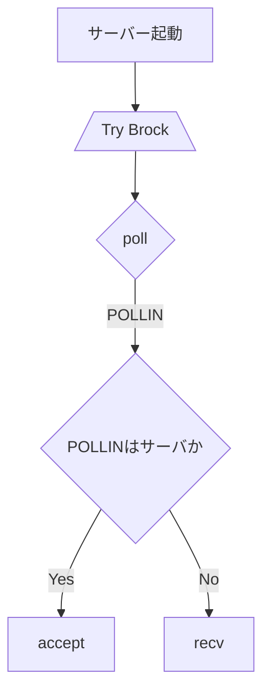

## サーバー起動準備




### Serverクラス
```cpp
class Server {
public:
    Server(int argc, const char *argv[]);
    ~Server();
    void run();


private:
    const std::string serverName; //    > 1.1 サーバー  サーバーは名前で一意に識別されます。この名前は、最大63文字（63）の文字です。サーバー名で使用される可能性のあるもの、および使用されないものについては、プロトコル文法ルール（セクション2.3.1）を参照してください。 
    const std::string password; // 32 自分で決めた
    const short port; //
    int sfd;
    struct sockaddr_in _addr;
    std::vector <struct pollfd> _pollFd;
    std::set <string> _nickHistory;

    void checkServerName(const std::string &serverName) const;
    void checkPassword(const std::string &password) const;

    Server();
    Server(const Server &server);
    Server &operator=(const Server &server);
}
```

### Userクラス
```cpp
class User {
public:
  User(const std::string &nick, const std::string &realName);
  ~User();
  void setNickName(const std::string &nickname);
  void setRealName(const std::string &realname);

private:
    std::string nickname; // 1.2.1 ユーザー 各ユーザーは、最大長さ9文字の一意のニックネームで他のユーザーと区別されます。ニックネームで使用される可能性のあるものとできないものについては、プロトコル文法規則（セクション2.3.1）を参照してください。 
    std::string realName; // 63 自分で決めた
}
```

### Channelクラス
```cpp
class Channel {
public:
  void addUser(User &user);
  void removeUser(User &user);
  void setTopic(const std::string &topic);

private:
    std::map <std::string, User &> users;
    std::string topic;
}
```

### CommandHandlerクラス
```cpp
class CommandHandler{
public:
    void handleCommad(const std::string &command, User &user);

private:
    void parseCommand(const std::string &commad);
    void executeCommand(const std::string &commandName, const std::vector<string> &params, User &user);
//    Password 
//    Nick 
//    User 
//    Oper
//    User mode
//    Service
//    Quit
//    Squit
}
```

```cpp
// static
class Replies {
public:
}
```
