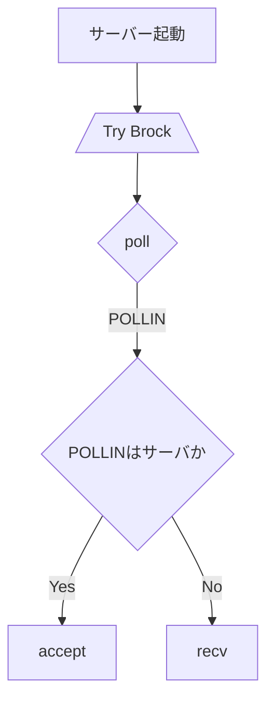

## サーバー起動準備



```cpp
class Server {
public:
    Server(int argc, const char *argv[]);
    ~Server();
private:
    const std::string serverName; //    > 1.1 サーバー  サーバーは名前で一意に識別されます。この名前は、最大63文字（63）の文字です。サーバー名で使用される可能性のあるもの、および使用されないものについては、プロトコル文法ルール（セクション2.3.1）を参照してください。 
    const std::string password; // 32 自分で決めた
    const short port; //
    int sfd;
    struct sockaddr_in _addr;
    std::vector <struct pollfd> _pollFd;
    std::set <string> _nickHistory;
}

class User {
public:
private:
    std::string nick; // 1.2.1 ユーザー 各ユーザーは、最大長さ9文字の一意のニックネームで他のユーザーと区別されます。ニックネームで使用される可能性のあるものとできないものについては、プロトコル文法規則（セクション2.3.1）を参照してください。 
    std::string realName; // 63 自分で決めた
}

class Channel {
public:
private:
    std::map <std::string, std::string> userName;
    std::string Channel Modes;
}

class CommandHandler{
public:
    handleCommand()
    execCommand()

private:
    Password 
    Nick 
    User 
    Oper
    User mode
    Service
    Quit
    Squit
}

// static
class Replies {
public:
}
```
